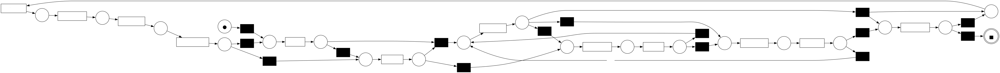

# Process Mining application on [Liqueur Plant](https://sites.google.com/site/uml4iot/liqueur-plant-case-study)

This repo contains the Python scripts and event logs that were utilized for the process mining application, which was conducted as part of my [thesis](https://hdl.handle.net/10889/27492). The event logs were generated using a simulation software of the system, that was created from my advisor. The aim of this repo is to provide all necessary resources for anyone who wishes to continue the work of my thesis or explore related areas. 

## Tech stack

**Programming Languages:** Python

**Libraries:** [PM4PY](https://pm4py.fit.fraunhofer.de/)

## Acknowledgements

 - [LiqueurPlant2024](https://github.com/ThramboulidisKleanthis/LiqueurPlant2024)
